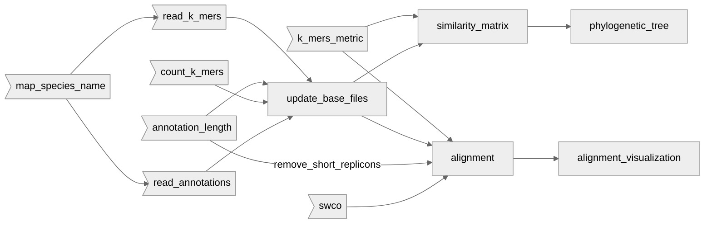

- update_base_files.py: takes the files from the feature_enriched folder and k_mers folder done by Dmitrii, aggregates them and creates/updates files built on top of them. The resulting files will help us execute the following steps. Dependencies:
	- ```read_k_mers.py```
	- ```count_k_mers.py```
	- ```annotation_length.py```
	- ```read_annotations.py```

- ```similarity_matrix.py``` once the files are updated, using the k_mers_metric functions with level = 'species', this script creates a similarity matrix between all the species. Then, it saves this matrix into a csv file. Depends of:
	- ```k_mers_metric.py```

- ```phylogenetic_tree.py```: 
	- Firstly, reads the similarity matrix. 
	- Then, it does a sanity check and removes the columns and the rows of the species which have a nan-value when comparing to another species. If this last step is not done, we will have problems when creating the tree.
	- Applies a function to transform it to a distance matrix. There is a parameter here to scale the transformation done. The parameter should be between 0 and 1
	- Creates phylogenetic tree, using biopython and ete3 libraries. You can specify the tree construction method: upgma or nj 
		- upgma having much better results right now

- ```alignment.py```: performs the alignment between specified sequences. We can specify which are our ```target_species```, considering only the relevant ```target_scaffold```, to compare them with the ```query_species``` which we can also limit to some ```query_scaffold```. If we not specify any of those parameters, the comparison is going to be performed among all of them. 
  For doing so, follows these steps:
	  -  reads the needed dataframes (almost all of the updated in the ``ùpdate_base_files`` script).
	  - Per each ```target_species```, per each ```target_scaffold```, computes the most similar ```query_scaffolds```, with the help of ```k_mers_metric.py```. 
	  - Performs Smith-Waterman algorithm to all of them by most similar order.
	  - Writes the results into an excel workbook
	  - Outputs a blocks csv file which will be used in ```alignment_visualization.py``` .
	This script depends of:
		  - ```swco.py```
		  - ```k_mers_metric.py```

- ```alignment_visualization.py```: reading the blocks file generated as output of the alignment, creates a plot relating the aligned parts of the different genomes. 

- Folder `annotations`:
	- ```read_annotations.py```: read all the annotations files from the different species. You can specify if you want just some species or all of them, given the list under the parameter species or leaving it empty, respectively. The function is designed to read the annotations through the files structure under the directory [feature_enriched]('..\Data\Intermediate\interim\feature_enriched') 
	- ```annotation_length.py```: This script contains different functions, with the aim to return two updated files reporting the length per species and scaffold, based in the annotations dataframe. Also, have a function to remove the scaffolds shorter than a ```threshold```, used afterwards in alignment.py

  - Folder `k_mers`:
	- ```read_k_mers.py```: this file contains functions to update the aggregated k-mers file, you can specify if you want to update the k-mers based in strict or relaxed locus, specifying it in the mode parameter. 
	  
	-  ```count_k_mers.py```: this script contains a function which takes as input the k-mers data frame. The output are two files which contains how many k-mers are per species and per scaffolds, respectively. 
	  
	- ```k_mers_metric.py```: functions to compute the metric based in k-mers. This metric can be computed in a species or scaffold (replicon_accession) level. In other words, takes the k-mers and computes the similarity metric among all the different k values aggregating that by species or scaffold, as a parameter called level. For doing so, counts the shared k-mers & the generated k-mers for the two comparing parts of the genomes and then computes the metric with the defined formula. 

-  Folder `align`: 
	- ```swco.py```: group of functions to perform the alignment and postprocess it, writing its results in the already created folder.

- Folder `species`:
	- `map_species_name`: maps the species name to its `gcf_id` name from the `config.yaml` file



Legend: 
- The > ] figures represent python files as functions repositories. All them are kept under some folder. They do not need to be executed.
- The [  ] figures represent executable python files.